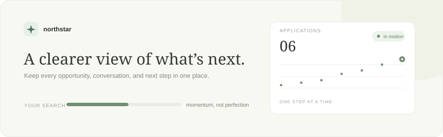

<div align="center">



# Northstar · Job Application Tracker

**A calmer, clearer workspace for the in-between.** Track opportunities, keep your next steps visible, and see momentum build across your search.

[](https://nextjs.org/)
[](https://react.dev/)
[](https://www.typescriptlang.org/)
[](LICENSE)

</div>

## The idea

Job searches scatter across spreadsheets, email, and memory. Northstar puts each opportunity and its next step in one focused view. This first release is a frontend product prototype: create and filter applications, switch between a table and a stage board, and keep the list in browser storage.

## Product tour

- **Portfolio overview:** pipeline size, active conversations, response rate, and the next interview at a glance.
- **Useful workflow:** add opportunities, filter by stage, search by company or role, and move cards between stages.
- **Persistent demo data:** changes survive refreshes in the current browser using `localStorage`.
- **Responsive layout:** sidebar navigation collapses for compact screens; board and table views adapt to mobile.
- **Accessible motion:** the interface honors `prefers-reduced-motion`.

> Authentication, Supabase persistence, email notifications, and server-side tenancy are intentionally not implemented in this prototype. Do not enter real candidate or employer data.

## Run locally

```bash
npm install
npm run dev
```

Open [http://localhost:3000](http://localhost:3000). To clear the demo state, remove the `northstar-jobs` entry from browser storage.

## Stack

Next.js App Router · React · TypeScript · Lucide · CSS · browser `localStorage`

## Next engineering milestones

1. Add Supabase Auth with row-level security scoped to the signed-in user.
2. Replace local storage with a typed data-access layer and PostgreSQL migrations.
3. Add interview events, reminders, and email through a server-side provider integration.
4. Introduce audit history, optimistic updates, validation, and conflict-safe writes.
5. Add deployment previews, error monitoring, and a documented production threat model.

## Data model sketch

`applications(id, user_id, company, role, stage, location, applied_at, created_at, updated_at)`

`interview_events(id, application_id, user_id, starts_at, kind, notes, reminder_at)`

In a production version, every query is scoped by `user_id`; stage changes and interview reminders are written through authenticated server routes.

## License

MIT. See [LICENSE](LICENSE).

